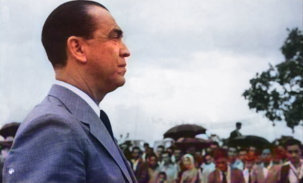

[issue-template]: ../../../issues/new?template=BUG_REPORT.md
[feature-template]: ../../../issues/new?template=FEATURE_REQUEST.md


# DeOldify

This service uses [DeOldify](https://github.com/jantic/DeOldify) to perform automatic image colorization.

It is part of our third party [DNN Model Services](https://github.com/singnet/dnn-model-services).

### Welcome

The service receives a grayscale image and uses it as an input for a pre-trained Torch model.

The model was trained on the [ImageNet](http://www.image-net.org/download-images).

### What’s the point?

The service can colorize grayscale images.

### How does it work?

The user must provide the following input in order to start the service and get a response:

Input:
  - `img_input`: A grayscale image URL.
  - `render_factor`: An integer factor between 7 and 45 (`default: 35`).

You can use this service from [SingularityNET DApp](http://beta.singularitynet.io/).

You can also call the service from SingularityNET CLI (`snet`).

Assuming that you have an open channel to this service:

```
$ snet client call snet deoldify-colorizer default_group colorize '{"img_input": "https://snet-models.s3.amazonaws.com/bh/Colorize/carnaval.jpg"}'

[Base64 Image]
```

### What to expect from this service?

Input Image:


Response:


Input Image:


Response:


Response (using `render_factor: 10`):



