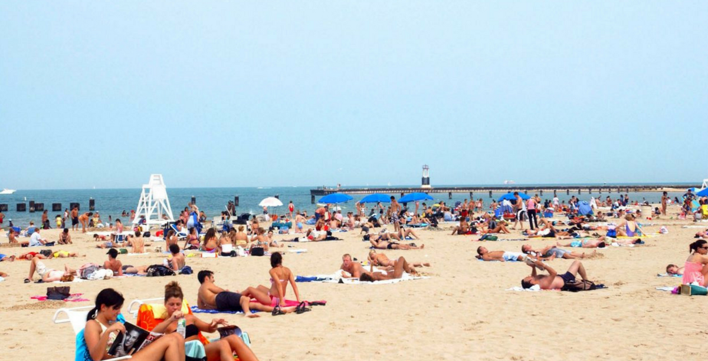
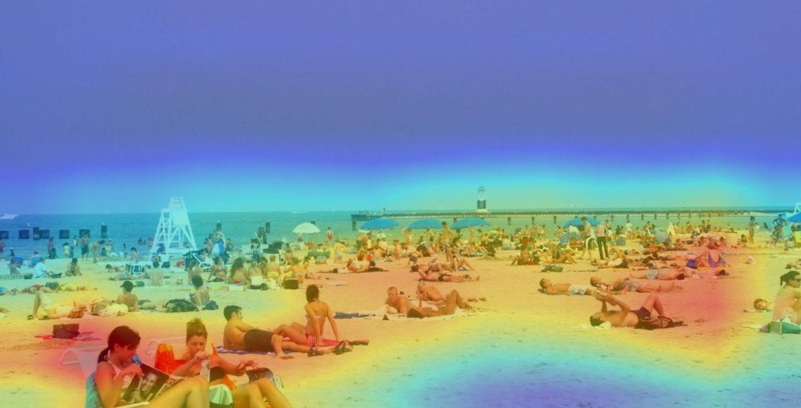
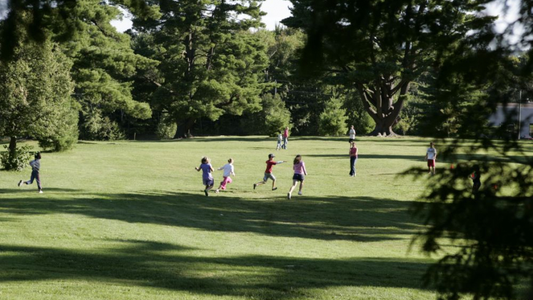
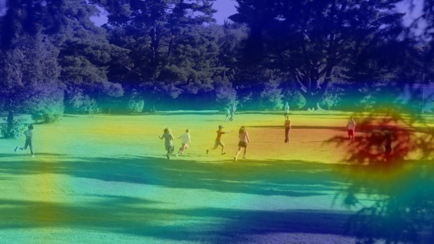

[issue-template]: ../../../issues/new?template=BUG_REPORT.md
[feature-template]: ../../../issues/new?template=FEATURE_REQUEST.md


# Places365 Scene Recognition

> This is the user's guide to the "Places365 Scene Recognition Service". It is registered at Ropsten Test Network onto SingularityNET's official organization (`snet`) under the name `places365-scene-recognition` as part of our third party [DNN Model Services](https://github.com/singnet/dnn-model-services).

### Welcome

This service uses a ResNet convolutional neural network model pre-trained on the [Places365](http://places2.csail.mit.edu/download.html) dataset to perform scene recognition and related tasks on images. 

### What’s the point?

Use this service to predict scene-related properties according to which flags to use as inputs, such as:
- whether its an indoor or outdoor environment (using the `io` flag); 
- what are the top-5 predictions of the scene where the photo was taken and its respective probabilities (`categories` flag);
- what are some scene related attributes (`attributes` flag);
- and even what regions of the image were the most relevant for the predictions, in which case you'd be shown what is called a "__c__lass __a__ctivation __m__apping": a heatmap image that highlights such high-relevance regions (`cam` flag).

### How does it work?

The service takes as **inputs**:
- `input_image`: the URL for a `.jpg` or `.png` input image over which the predictions will be made. This is a required field.
- `predict`: a string of comma-separated words describing what you want the service to return. Possible values are `io`, `categories`, `attributes` and `cam`. These can appear at any order and are case-insensitive (e.g.: `"predict": "CAM, Categories"` is a valid example, as is `"predict":"io,attributes,cam"`). If left empty, it will return all possible predictions. See some example calls below.

And returns as **output**:
- a json-encoded string in which the keys are the words you use as inputs in the `predict` field and the values are their respective returns as strings. In the case of the class activation mappings (`cam`), it will be a base64-encoded `.jpg` image.

You can call the `places365-scene-recognition` service by installing the [SingularityNET Cli](https://github.com/singnet/snet-cli) through its `snet client call` command. Assuming you have an open channel to this service:

1. Fill in the method and some input data as defined in the service's `.proto` file.

Example call:
```
$ snet client call snet places365-scene-recognition default_group recognize_scene '{"input_image":"https://static1.squarespace.com/static/564783d5e4b077901c4bdc37/t/5a823d47c83025d76ac6ddae/1518484818865/Piccolo-104.jpg?format=1500w", "predict":"io, categories"}'
...
data: "{\"io\": \"indoor\", \"categories\": \" 0.924 -> beauty_salon, 0.006 -> gymnasium/indoor, 0.005 -> clean_room, 0.005 -> biology_laboratory, 0.004 -> chemistry_lab,\"}"
```

_You'll soon also be able to call this service using a user interface through SingularityNET's DApp. Check [SNET's official website](http://singularitynet.io/) for updates._

### What to expect from this service?

#### Example 1

- **Input**

    `input_image`: 
    
    `predict`: "io, categories"

- **Output**

    `io`: "indoor"
    
    `categories`: " 0.924 -> beauty_salon, 0.006 -> gymnasium/indoor, 0.005 -> clean_room, 0.005 -> biology_laboratory, 0.004 -> chemistry_lab,"
    
#### Example 2

- **Input**

    `input_image`: 
    
    `predict`: "IO, Attributes, Categories, CAM"
    
- **Output**
    
    `io`: "outdoor"
    
    `categories`: "0.660 -> volleyball_court/outdoor, 0.102 -> beach, 0.085 -> beach_house, 0.027 -> lagoon, 0.021 -> promenade,"
    
    `attributes`: "open area, natural light, sunny, far-away horizon, warm, man-made, clouds, sand, touring"
    
    `cam`:  

#### Example 3

The following image was found under [Google Images](http://images.google.com) by searching for "park". _The `predict` field was intentionally left empty: service will output all the possibilities._

- **Input**

    `input_image`: 
    
    `predict`: ""

- **Output**

    `io`: "outdoor"
    
    `categories`:  "0.192 -> golf_course, 0.101 -> park, 0.096 -> picnic_area, 0.079 -> lawn, 0.066 -> volleyball_court/outdoor,"
    
    `attributes`: "open area, natural light, sunny, far-away horizon, warm, man-made, clouds, sand, touring"
    
    `cam`: 
    