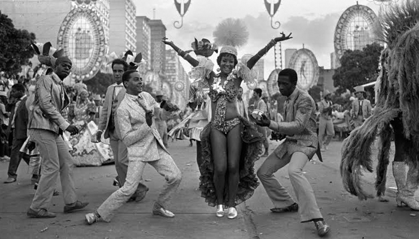
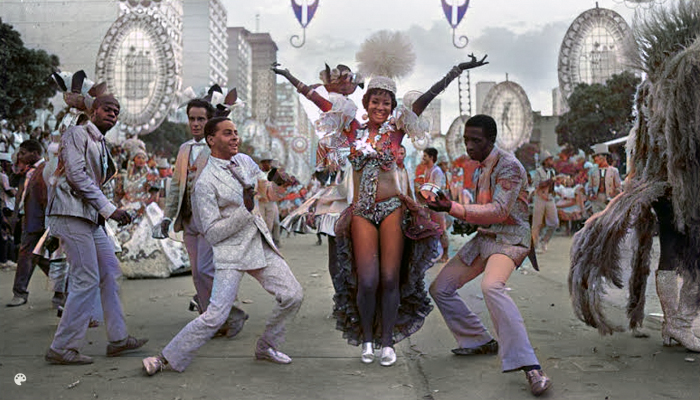
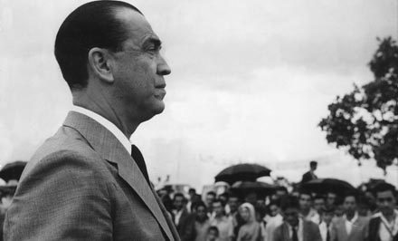
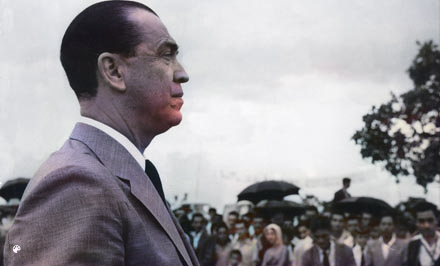

[issue-template]: ../../../issues/new?template=BUG_REPORT.md
[feature-template]: ../../../issues/new?template=FEATURE_REQUEST.md


# Let there be Color!

This service uses [Let there be Color!](http://iizuka.cs.tsukuba.ac.jp/projects/colorization/en/) to perform colorization on grayscale images.

It is part of our third party [DNN Model Services](https://github.com/singnet/dnn-model-services).

### Welcome

The service receives a grayscale image and uses it as an input for a pre-trained Torch model.

The model was trained on the [Places dataset](http://places.csail.mit.edu/) and thus best performance is for natural outdoor images.

### What’s the point?

The service can colorize grayscale images.

### How does it work?

The user must provide the following input in order to start the service and get a response:

Input:
  - `img_input`: A grayscale image URL.

You can use this service from [SingularityNET DApp](http://beta.singularitynet.io/).

You can also call the service from SingularityNET CLI (`snet`).

Assuming that you have an open channel to this service:

```
$ snet client call snet siggraph-colorization default_group colorize '{"img_input": "https://snet-models.s3.amazonaws.com/bh/Colorize/carnaval.jpg"}'

[Base64 Image]
```

### What to expect from this service?

Input Image:




Response:




Input Image:




Response:



