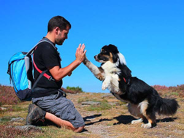
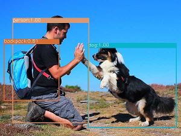

[issue-template]: ../../../issues/new?template=BUG_REPORT.md
[feature-template]: ../../../issues/new?template=FEATURE_REQUEST.md


# Object Detection

This service uses [YOLOv3](https://pjreddie.com/darknet/yolo/) to perform object detection on images.

It is part of our third party [DNN Model Services](https://github.com/singnet/dnn-model-services).

### Welcome

The service receives an image and uses it as an input for a pre-trained `YOLOv3` model.

The model can detect objects (80 classes) from [COCO Dataset](http://cocodataset.org/#overview).

### What’s the point?

The service makes prediction using computer vision and machine learning techniques.

The service outputs an image with a bounding box for each object that it has predicted (and its confidence).

### How does it work?

The user must provide the following inputs in order to start the service and get a response:

Inputs:
  - `model`: DNN Model ("yolov3").
  - `img_path`: An image URL.
  - `confidence`: Confidence of object detection (between 0 and 1).

You can use this service from [SingularityNET DApp](http://beta.singularitynet.io/), clicking on `SNET/ObjectDetection`.

You can also call the service from SingularityNET CLI (`snet`).

Assuming that you have an open channel to this service:

```
$ snet client call snet yolov3-object-detection default_group detect '{"model": "yolov3", "img_path": "https://hips.hearstapps.com/amv-prod-cad-assets.s3.amazonaws.com/images/media/51/2017-10best-lead-photo-672628-s-original.jpg", "confidence": "0.5"}'
...
Read call params from cmdline...

Calling service...

    response:
        boxes: '[[8.5, 151.0, 223, 118], [294.0, 138.0, 78, 48], [127.0, 185.5, 250, 209],
            [605.0, 152.5, 224, 115], [432.0, 129.5, 86, 55], [205.5, 129.0, 81, 38],
            [18.5, 127.0, 127, 40], [439.5, 187.5, 299, 225], [525.0, 132.0, 88, 34],
            [694.5, 126.0, 115, 40]]'
        class_ids: '[2, 2, 2, 2, 2, 2, 2, 2, 2, 2]'
        confidences: '[0.998349130153656, 0.9982008337974548, 0.9977825284004211, 0.995550811290741,
            0.9875208735466003, 0.980316698551178, 0.9753901362419128, 0.969804048538208,
            0.9632347226142883, 0.9579626321792603]'
        delta_time: '2.0124'
        img_base64: ... (BASE64_BBOX_IMAGE)
```

### What to expect from this service?

Input Image:



with:
- `model: yolov3`
- `confidence: 0.1`

Response:


